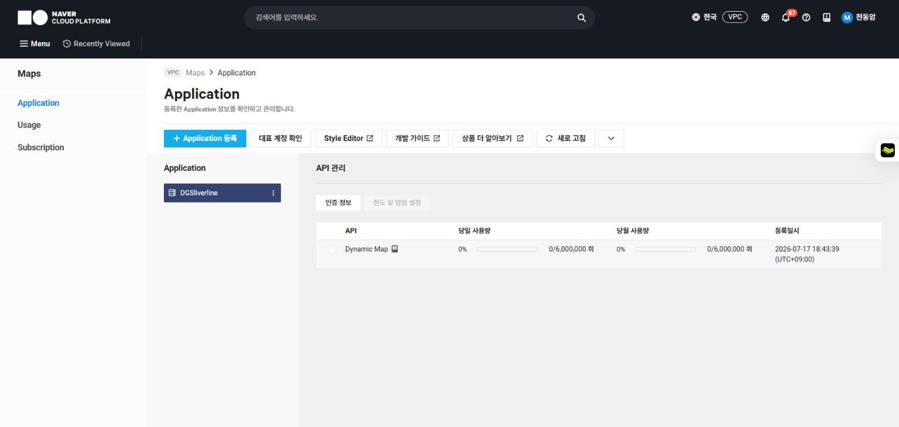
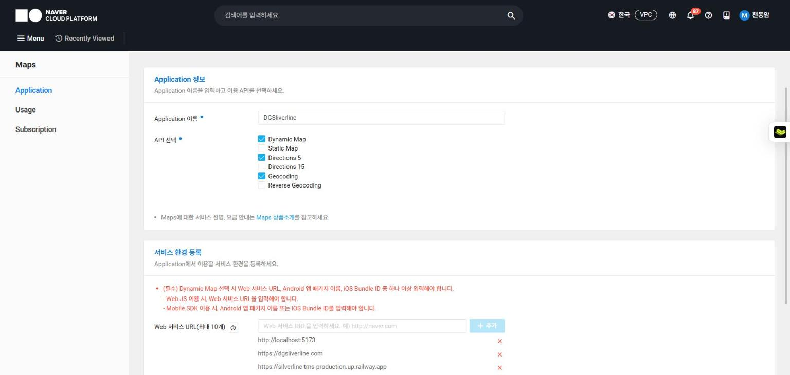
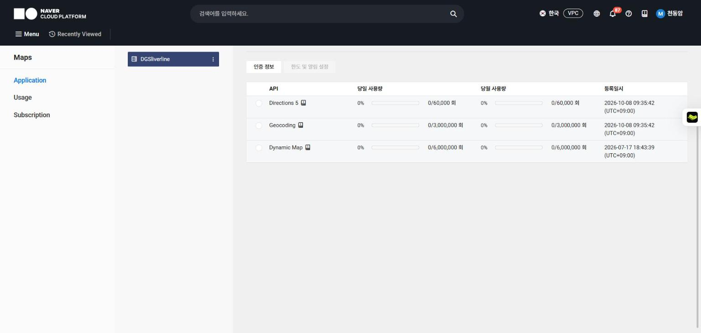
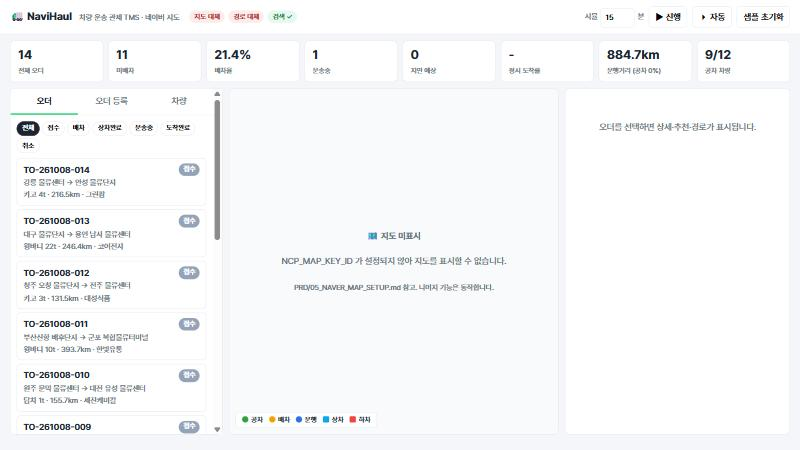
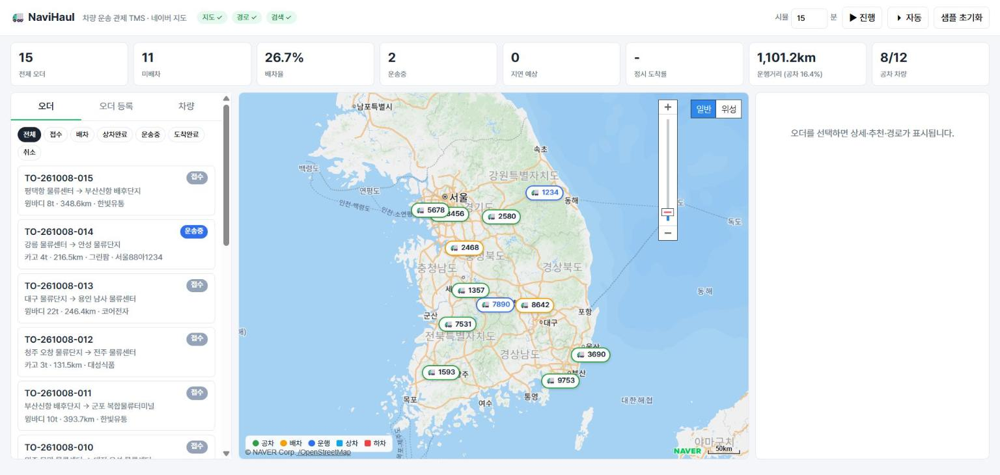
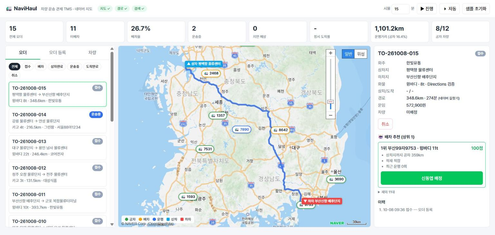
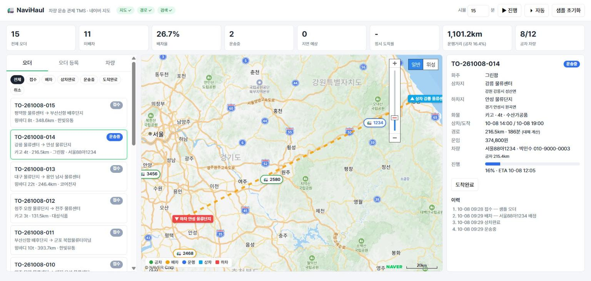
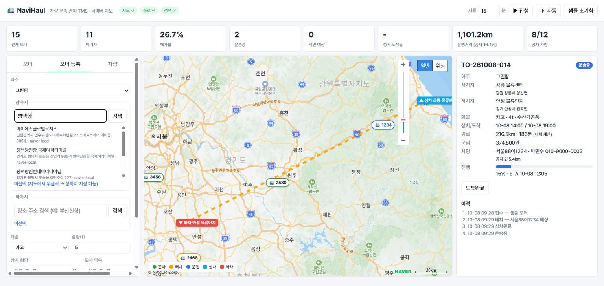
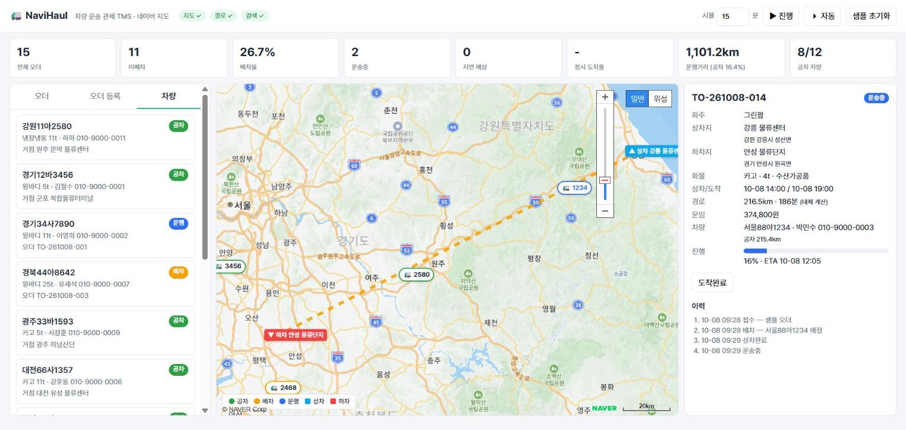
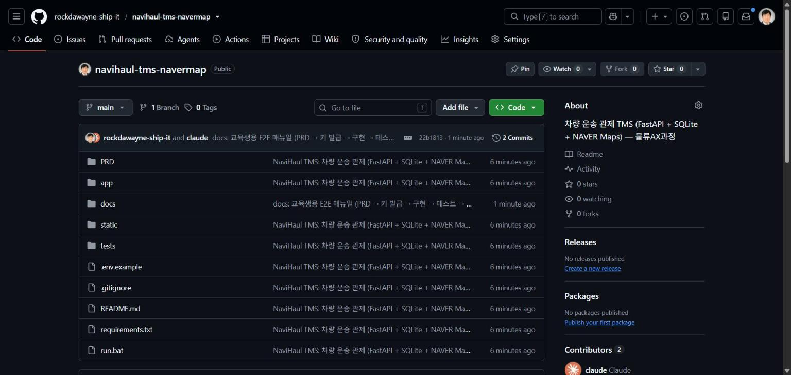

# NaviHaul 차량 운송 관제 TMS — PRD부터 실행·배포까지 E2E 매뉴얼 (교육생용)

> 대상: 한국물류진흥재단 물류AX과정 수강생 (코딩 경험 없어도 됨)
> 도구: Claude Code + Python 3.13 + NAVER Cloud Platform Maps
> 소요 시간: 약 3~4시간 (PRD 40분 · 키 발급 15분 · 구현 90분 · 검증 30분 · 배포 15분)
> 완성 예시: https://github.com/rockdawayne-ship-it/navihaul-tms-navermap

이 매뉴얼은 "운송 오더를 등록하면 네이버 지도에서 경로를 계산하고, 차량을 추천해 배차한 뒤, 운송 중 차량을 지도에서 관제하는 웹 프로그램"을 처음부터 끝까지 만드는 과정을 다룹니다. 각 단계마다 **Claude Code에 붙여넣을 프롬프트**와 **확인해야 할 결과**를 함께 적었습니다. 프롬프트 박스는 그대로 복사해 쓰면 됩니다.

---

## 목차

0. 시작 전 준비
1. 1단계 — PRD 작성 (무엇을 만들지 정하기)
2. 2단계 — 설계 문서 (데이터 모델·단계·기술 스펙)
3. 3단계 — 네이버 지도 API 키 발급
4. 4단계 — 백엔드 구현 (DB · 네이버 API · 배차 추천 · 시뮬레이터)
5. 5단계 — 프론트 구현 (네이버 지도 관제 화면)
6. 6단계 — 자동 테스트
7. 7단계 — 실행과 브라우저 검증
8. 8단계 — GitHub 배포
9. 문제 해결 (FAQ)
10. 확장 과제
- 부록 A. 전체 폴더 구조
- 부록 B. API 목록
- 부록 C. 배차 추천 점수 공식
- 부록 D. 이 프로젝트에서 쓴 Claude Code 프롬프트 모음

---

## 0. 시작 전 준비

### 0-1. 설치 확인

PowerShell을 열고 아래를 하나씩 실행합니다. 버전이 나오면 설치된 것입니다.

```powershell
py -3.13 --version        # Python 3.13.x
git --version             # git version 2.x
gh --version              # gh version 2.x  (GitHub CLI, 8단계에서 사용)
claude --version          # Claude Code
```

없는 항목 설치:

| 도구 | 설치 |
|------|------|
| Python 3.13 | https://www.python.org/downloads/ → "Add python.exe to PATH" 체크 |
| Git | https://git-scm.com/download/win |
| GitHub CLI | `winget install GitHub.cli` 후 `gh auth login` |
| Claude Code | 과정 1일차 자료 "클로드 코드 설치 및 기본 세팅" 참고 |

### 0-2. 계정 준비

| 계정 | 용도 | 비고 |
|------|------|------|
| NAVER Cloud Platform (https://www.ncloud.com) | 지도·경로·주소 API | 가입 시 결제수단 등록 필요. 이 실습 사용량은 무료 구간 안 |
| GitHub | 결과물 배포 | 8단계 |

### 0-3. 작업 폴더 만들기

```powershell
mkdir 차량운송_TMS_NaverMap
cd 차량운송_TMS_NaverMap
claude
```

Claude Code가 이 폴더 안에서 실행됩니다. 이후 모든 프롬프트는 이 Claude Code 창에 입력합니다.

---

## 1. 1단계 — PRD 작성

PRD(Product Requirements Document)는 "무엇을, 누구를 위해, 어디까지 만들지"를 적은 문서입니다. 코드를 짜기 전에 PRD가 있어야 Claude가 엉뚱한 것을 만들지 않습니다.

### 1-1. 참고 자료 읽히기

기존 자료가 있으면 먼저 Claude에게 읽힙니다. 이번 과정에서는 1일차의 `배차프로그램/PRD`(배차 PRD)와 `카카오 맵 활용 TMS 만들기 위한 설정가이드`가 참고 자료였습니다.

> **프롬프트 1-1**
> ```
> 이 폴더 상위에 있는 "배차프로그램/PRD" 와 "카카오 맵 활용 TMS 만들기 위한 설정가이드" 를 읽고 요약해줘.
> 이걸 바탕으로 차량 운송 관제 TMS PRD를 만들 건데, 지도는 카카오가 아니라 네이버 지도를 쓸 거야.
> ```

참고 자료가 없으면 이 단계는 건너뛰고 1-2로 갑니다.

### 1-2. PRD 생성

> **프롬프트 1-2**
> ```
> PRD/01_PRD.md 를 작성해줘. 내용:
> - 제품: 화물 운송 오더(상차지→하차지)를 등록하면 네이버 지도에서 경로·거리·소요시간을 계산하고,
>   조건에 맞는 차량을 추천해 배차한 뒤, 운송 중 차량 위치·ETA를 네이버 지도에서 관제하는 웹 TMS
> - 사용자: 관제·배차 담당자(PC), 운영 관리자. 기사 모바일은 Phase 3
> - 핵심 기능 표 (우선순위 P1/P2/P3): 지도 관제, 오더 등록(장소 검색→좌표), 경로 계산(Directions 5, 실패 시 대체),
>   차량 관리, 배차 추천+배정, 상태 흐름, 운송 시뮬레이터, ETA·지연 경고, KPI, 운임
> - 상태 정의: REQUESTED→ASSIGNED→LOADED→IN_TRANSIT→DELIVERED, CANCELLED. 전이 규칙 표
> - 성공 기준 6개 (체크박스)
> - 안 만드는 것 (완전 자동 배차, VRP, 네이티브 앱, 화주 포털, 로그인)
> - 결정 사항 / 미결 사항
> ```

**확인할 것**
- `PRD/01_PRD.md` 파일이 생겼는지
- "안 만드는 것" 섹션이 있는지 — 이게 없으면 Claude가 나중에 범위를 멋대로 넓힙니다
- 상태 전이 표에 "누가 바꾸는지"와 "다음 상태"가 있는지

### 1-3. PRD 읽고 고치기

생성된 PRD를 **직접 읽습니다.** 본인 회사·현장과 다른 부분(차종 이름, 운임 기준, 상태 이름)을 고치라고 시킵니다.

> **프롬프트 1-3 (예시)**
> ```
> 01_PRD.md 에서 차종을 카고/윙바디/탑차/냉장냉동 4종으로 고정하고,
> 운임은 "기본 50,000원 + 1,500원/km × 톤급 계수" 예시로 넣어줘. 나머지는 유지.
> ```

---

## 2. 2단계 — 설계 문서

PRD 한 장만으로는 구현이 흔들립니다. 데이터 모델·개발 순서·기술 스펙을 분리해 둡니다.

> **프롬프트 2-1**
> ```
> PRD/01_PRD.md 기준으로 아래 문서를 만들어줘.
> - PRD/02_DATA_MODEL.md: SQLite 테이블 (shippers, vehicles, orders, order_events, vehicle_positions)
>   컬럼·타입·설명 표, 차종 호환 규칙, 운임 계산식
> - PRD/03_PHASES.md: Phase 1 지도 관제 MVP (이번 범위) / Phase 2 운영 고도화 / Phase 3 현장 연동
> - PRD/04_PROJECT_SPEC.md: 기술 스택(FastAPI + SQLite + 바닐라 JS + NAVER Maps JS v3),
>   폴더 구조, API 목록, 환경 변수(.env), "절대 하지 마" 목록, 실행 방법
> - PRD/05_NAVER_MAP_SETUP.md: 네이버 지도 API 키 발급 가이드 (교육생용, 카카오 가이드 형식 참고)
> - PRD/README.md: 문서 목차
> ```

**왜 FastAPI + 바닐라 JS인가?**
1일차 배차 프로그램은 Streamlit이었습니다. 그런데 네이버 지도 JS SDK는 **등록된 도메인에서 직접 `<script>`로 로드**해야 하고, Streamlit은 지도를 iframe 안에 넣기 때문에 마커 클릭·경로 갱신 같은 양방향 제어가 어렵습니다. 그래서 이 프로젝트는 Python이 API를 제공하고 HTML/JS가 지도를 직접 다루는 구조로 바꿨습니다.

**확인할 것**
- `04_PROJECT_SPEC.md`의 "절대 하지 마"에 다음이 있는지:
  - Client Secret을 프론트로 보내지 말 것
  - `.env`를 커밋하지 말 것
  - 상태 전이를 프론트에서 판단하지 말 것
  - 네이버 API 실패를 예외로 터뜨리지 말 것 (대체 계산)

---

## 3. 3단계 — 네이버 지도 API 키 발급

> 상세 화면 설명은 `PRD/05_NAVER_MAP_SETUP.md` 참고. 여기서는 순서만 적습니다.

### 3-1. 개념 정리 — 키가 두 종류 있음

| 키 | 어디서 발급 | 무엇에 쓰나 | 이 프로젝트 .env 이름 |
|----|-------------|-------------|------------------------|
| NCP Maps Client ID / Secret | console.ncloud.com → Maps | 지도 표시, 주소→좌표, 도로 경로 | `NCP_MAP_KEY_ID`, `NCP_MAP_KEY` |
| 네이버 개발자센터 Client ID / Secret | developers.naver.com | 상호명 검색(지역 검색 API) | `NAVER_CLIENT_ID`, `NAVER_CLIENT_SECRET` (선택) |

두 키는 **서로 호환되지 않습니다.** 개발자센터 키를 Maps API에 넣으면 `401 Authentication Failed`가 납니다. 이 실습에서 가장 흔한 실수입니다.

### 3-2. NCP Maps Application 등록

1. https://console.ncloud.com 로그인
2. 상단 검색창에 `Maps` 입력 → **Maps** 서비스 → 왼쪽 **Application**



> **화면 설명 — Maps Application 목록**
> 왼쪽 메뉴 `Maps > Application`. 가운데 파란 **Application 등록** 버튼으로 새로 만듭니다. 이미 만든 Application이 있으면(그림의 `DGSliverline`) 목록에 보이고, 오른쪽 **API 관리** 표에서 어떤 API가 켜져 있는지와 당일·당월 사용량을 확인할 수 있습니다. 이 그림은 Dynamic Map만 켜진 상태라서 3-2의 5번 단계처럼 Directions 5·Geocoding을 추가해야 합니다. 주의: 주소가 `console.ncloud.com/naver-service/application`(AI·NAVER API)이면 **예전 메뉴**입니다. Maps는 `console.ncloud.com/maps/application`에 있습니다.
3. **Application 등록** 클릭
4. Application 이름: 자유 (예: `NaviHaul-TMS`)
5. **API 선택**에서 체크:
   - ☑ Dynamic Map (지도 화면 — 필수)
   - ☑ Geocoding (주소→좌표)
   - ☑ Directions 5 (도로 경로)
6. **서비스 환경 등록 → Web 서비스 URL**에 `http://localhost:8520` 입력 후 **추가**
7. **등록** (또는 수정 화면이면 **저장**)



> **화면 설명 — Application 등록/수정 화면**
> 위쪽 **API 선택**에서 `Dynamic Map`, `Directions 5`, `Geocoding` 세 개에 체크합니다. `Static Map`, `Directions 15`, `Reverse Geocoding`은 이 프로젝트에서 쓰지 않습니다(체크해도 무방하나 불필요). 아래쪽 **서비스 환경 등록 → Web 서비스 URL** 입력칸에 `http://localhost:8520`을 넣고 오른쪽 **+ 추가**를 눌러야 목록에 들어갑니다. 입력만 하고 추가를 안 누르면 저장되지 않습니다. 빨간 안내문처럼 Dynamic Map을 쓰려면 Web 서비스 URL이 최소 1개 있어야 합니다. 목록에는 최대 10개까지 넣을 수 있으니 나중에 배포 주소(예: `https://내서비스.com`)를 추가해도 됩니다.



> **화면 설명 — 저장 후**
> API 관리 표에 `Directions 5 (0/60,000회)`, `Geocoding (0/3,000,000회)`, `Dynamic Map (0/6,000,000회)` 세 줄이 보이면 성공입니다. 오른쪽 숫자가 월 무료 한도입니다. 실습에서는 오더 1건 등록당 Directions 5 1회, 장소 검색 1번당 Geocoding 1회를 씁니다. 교육생 30명이 각자 100건씩 등록해도 3,000회로 한도의 5%입니다.

8. 목록에서 Application 클릭 → **인증 정보** → Client ID, Client Secret 복사
   - 인증 정보 창에서 `Client ID (X-NCP-APIGW-API-KEY-ID)`가 `.env`의 `NCP_MAP_KEY_ID`, `Client Secret (X-NCP-APIGW-API-KEY)`가 `NCP_MAP_KEY`입니다. 괄호 안 헤더 이름이 코드(`app/naver.py`의 `_ncp_headers()`)에 그대로 들어갑니다.

### 3-3. .env 파일 만들기

프로젝트 폴더에서:

```powershell
copy .env.example .env
notepad .env
```

```env
NCP_MAP_KEY_ID=복사한_Client_ID
NCP_MAP_KEY=복사한_Client_Secret
```

저장 후 닫습니다. `.env`는 `.gitignore`에 들어 있어 GitHub에 올라가지 않습니다. 단톡방·메일로도 공유하지 마세요. 노출되면 콘솔에서 **재발급**합니다.

### 3-4. 키 동작 확인 (선택)

```powershell
$id="복사한_Client_ID"; $sec="복사한_Client_Secret"
Invoke-RestMethod -Uri "https://maps.apigw.ntruss.com/map-geocode/v2/geocode?query=서울특별시 중구 한강대로 405" -Headers @{'x-ncp-apigw-api-key-id'=$id;'x-ncp-apigw-api-key'=$sec}
```

`addresses` 배열에 좌표가 나오면 성공. `401`이면 키 종류 또는 오타 확인.

---

## 4. 4단계 — 백엔드 구현

백엔드는 9개 파일입니다. 한 번에 다 시키지 말고 **4번에 나눠** 시킵니다. 한 번에 시키면 오류가 섞여 어디가 문제인지 찾기 어렵습니다.

### 4-1. 설정 + DB

> **프롬프트 4-1**
> ```
> PRD/02_DATA_MODEL.md 와 04_PROJECT_SPEC.md 를 읽고 아래 파일을 만들어줘.
> - app/__init__.py (빈 파일)
> - app/config.py: .env 를 직접 읽어 os.environ 에 넣는 함수(외부 라이브러리 없이),
>   NCP_MAP_KEY_ID, NCP_MAP_KEY, NCP_MAPS_BASE(기본 https://maps.apigw.ntruss.com),
>   NAVER_CLIENT_ID/SECRET, DB_PATH(data/tms.db), PORT(8520).
>   features() 함수: map/directions/geocode/local_search 가용 여부 dict. Secret 은 절대 포함하지 말 것.
> - app/db.py: sqlite3 표준 모듈. SCHEMA 문자열(테이블 5개), init_db(), get_conn() 컨텍스트 매니저
>   (commit/rollback), rows()/one() 헬퍼. PRAGMA journal_mode=WAL, foreign_keys=ON.
> - requirements.txt: fastapi, uvicorn[standard], httpx, pytest
> - .env.example, .gitignore(.env, data/, __pycache__, .pytest_cache)
> ```

**핵심 코드 — .env 읽기 (`app/config.py`)**

```python
def _load_dotenv(path: Path) -> None:
    if not path.exists():
        return
    for line in path.read_text(encoding="utf-8").splitlines():
        line = line.strip()
        if not line or line.startswith("#") or "=" not in line:
            continue
        key, _, value = line.partition("=")
        key, value = key.strip(), value.strip().strip('"').strip("'")
        if key and key not in os.environ:
            os.environ[key] = value
```

`python-dotenv` 같은 라이브러리 없이도 이 10줄이면 됩니다. 이미 OS 환경변수에 있는 값은 덮어쓰지 않습니다(`key not in os.environ`).

### 4-2. 좌표 계산 + 네이버 API 래퍼

> **프롬프트 4-2**
> ```
> - app/geo.py: haversine_km(lat1,lng1,lat2,lng2), fallback_route(직선 보간 경로, 거리 = 직선×1.3,
>   시간 = 거리/70km/h, path 는 [[lng,lat],...] 네이버 형식, source="fallback"),
>   path_length_km(path), point_along(path, progress 0~1) → (lat,lng)
> - app/naver.py: httpx 사용.
>   geocode(query) → NCP Geocoding, local_search(query) → 네이버 개발자센터 지역검색(mapx/mapy 는 1e7 로 나눔),
>   search_places(query) → 둘 다 호출 후 좌표 기준 중복 제거,
>   directions(lat1,lng1,lat2,lng2, option="trafast") → NCP Directions 5 driving.
>   path 가 400점 넘으면 샘플링. 모든 함수는 키 없음/HTTP 오류/타임아웃 시 예외 대신 빈 리스트 또는 fallback_route 반환.
> ```

**핵심 코드 — Directions 5 호출 (`app/naver.py`)**

```python
url = f"{config.NCP_MAPS_BASE}/map-direction/v1/driving"
params = {"start": f"{lng1},{lat1}", "goal": f"{lng2},{lat2}", "option": option}
r = httpx.get(url, params=params, headers=_ncp_headers(), timeout=TIMEOUT)
route = r.json()["route"][option][0]
summ = route["summary"]          # distance(m), duration(ms)
path = route["path"]             # [[lng, lat], ...]
```

주의 3가지:
1. 네이버는 **경도,위도(lng,lat)** 순서입니다. 구글·카카오와 반대입니다.
2. `distance`는 미터, `duration`은 밀리초입니다. km·분으로 바꿔 저장합니다.
3. `option=trafast`(실시간 빠른길) 외에 `traoptimal`(최적), `tracomfort`(편한길)이 있습니다.

**왜 대체(fallback) 계산이 필요한가?**
키가 없거나 네트워크가 막혀도 앱은 켜져야 합니다. 직선거리 × 1.3은 한국 도로망 기준 평균 우회율입니다. 화면에서는 대체 경로를 **주황 점선**으로 그려 구분합니다.

### 4-3. 배차 규칙 + 오더 로직 + 시뮬레이터

> **프롬프트 4-3**
> ```
> - app/dispatch.py: VEHICLE_TYPES, COMPATIBLE(요구 차종→허용 차종: REEFER→{REEFER}, WING→{WING},
>   BOX→{BOX,WING}, CARGO→{CARGO,WING}), eligible(order, vehicle)→(bool, 사유),
>   fare(distance_km, weight_ton) = 50,000 + km×1,500×톤급계수(1t .6/2.5t .8/5t 1/11t 1.4/25t 1.9) 100원 반올림,
>   recommend(order, vehicles, trip_counts, top=3): 점수 = 공차거리 60 + 적재적합 25 + 공평성 15, reasons 리스트, rejected 리스트
> - app/orders.py: ALLOWED 전이표(유일한 기준), STATUS_KO, TransitionError,
>   create_order(경로 계산 + 운임 + REQUESTED 이벤트), get_order(route_path JSON 파싱 + events),
>   list_orders(status), recommend, assign(eligible 검사 → ASSIGNED, empty_km 기록, 차량 ASSIGNED),
>   change_status(LOADED: 차량 ON_TRIP·위치=상차지 / IN_TRANSIT: eta 계산 / DELIVERED: 차량 IDLE·위치=하차지 / CANCELLED: 차량 해제),
>   kpi() (오더 수, 상태별, 배차율, 운송중, 지연, 정시율, 총km, 공차km, 운임합, 차량 상태)
> - app/simulator.py: tick(conn, minutes, auto_deliver=True): IN_TRANSIT 오더의 progress += minutes/duration_min,
>   point_along 으로 차량 위치 갱신, eta 재계산, vehicle_positions 기록, progress≥1 이면 DELIVERED 처리
> - app/seed.py: 전국 거점 16곳 좌표, 화주 5, 차량 12, 오더 14. reset(conn) 으로 초기화.
>   시연용으로 오더 1~3 배정, 1번은 IN_TRANSIT progress 0.35
> ```

**핵심 코드 — 상태 전이표 (`app/orders.py`)**

```python
ALLOWED = {
    "REQUESTED": {"ASSIGNED", "CANCELLED"},
    "ASSIGNED": {"LOADED", "CANCELLED"},
    "LOADED": {"IN_TRANSIT"},
    "IN_TRANSIT": {"DELIVERED"},
    "DELIVERED": set(),
    "CANCELLED": set(),
}

def _transition(conn, o, to, note=""):
    if to not in ALLOWED.get(o["status"], set()):
        raise TransitionError(f"{STATUS_KO.get(o['status'])} → {STATUS_KO.get(to, to)} 전이 불가")
    conn.execute("INSERT INTO order_events ...", (o["id"], o["status"], to, note, now_iso()))
```

이 표 하나가 "접수에서 바로 운송중으로 못 간다" 같은 업무 규칙 전체입니다. 프론트 버튼은 이 표를 API에서 받아 그리기만 합니다. 규칙을 바꿀 때는 **여기 한 곳만** 고칩니다.

**핵심 코드 — 추천 점수 (`app/dispatch.py`)**

```python
s_dist = 60 * (1 - empty_km / max_empty)     # 상차지까지 공차거리가 짧을수록 높음
s_fit  = 25 if 적재여유 ≤ 1.5배 else 15 if ≤ 2.5배 else 5   # 25t 차에 1t 싣는 낭비 방지
s_fair = 15 * (1 - trips / max_trips)        # 운행 횟수 적은 차량 우대
score  = s_dist + s_fit + s_fair             # 0~100
```

점수와 함께 `reasons = ["상차지까지 공차 42km", "적재 적합", "최근 운행 1회"]`를 돌려줍니다. 화면에 "왜 이 차량인지"가 보여야 담당자가 믿고 씁니다. PRD의 "추천 + 사람 확정" 원칙입니다.

### 4-4. API 서버

> **프롬프트 4-4**
> ```
> app/main.py: FastAPI. lifespan 에서 init_db + 차량 0대면 seed.reset.
> 라우트: GET /api/config (map_key_id, features, statuses, allowed — Secret 제외),
> GET /api/places?q=, GET /api/shippers, GET /api/vehicles (진행중 오더 join),
> GET /api/orders?status=, GET /api/orders/{id}, POST /api/orders (pydantic 검증, 201),
> GET /api/orders/{id}/recommend, POST /api/orders/{id}/assign, POST /api/orders/{id}/status,
> POST /api/sim/tick, GET /api/kpi, POST /api/reset, GET / → static/index.html, /static 마운트.
> TransitionError 는 409, 없는 id 는 404.
> run.bat: py -3.13 -m uvicorn app.main:app --host 127.0.0.1 --port 8520
> ```

**확인할 것**

```powershell
py -3.13 -m pip install -r requirements.txt
py -3.13 -m uvicorn app.main:app --port 8520
```

다른 PowerShell 창에서:

```powershell
Invoke-RestMethod http://127.0.0.1:8520/api/config
Invoke-RestMethod http://127.0.0.1:8520/api/kpi
```

`features`에 `map: True, directions: True, geocode: True`가 나오면 키가 제대로 읽힌 것입니다. `False`면 `.env` 위치(프로젝트 루트)와 키 이름을 확인합니다.

---

## 5. 5단계 — 프론트 구현

프론트는 3개 파일(`static/index.html`, `app.js`, `style.css`)입니다. 프레임워크 없이 순수 JS입니다.

> **프롬프트 5-1**
> ```
> static/ 에 관제 화면을 만들어줘. 프레임워크 없이 HTML/CSS/JS.
> 레이아웃: 상단(브랜드, 기능 배지 지도/경로/검색, 시뮬 분 입력 + ▶진행 + ⏵자동 + 샘플 초기화) /
> KPI 카드 8개 / 3열(왼쪽 탭: 오더 목록(상태 필터)·오더 등록 폼·차량 목록, 가운데: 네이버 지도, 오른쪽: 오더 상세·추천·이력)
>
> 네이버 지도:
> - /api/config 의 map_key_id 로 https://oapi.map.naver.com/openapi/v3/maps.js?ncpKeyId= 를 동적 로드
> - window.navermap_authFailure 정의 → 인증 실패 시 지도 자리에 안내 문구 (Web 서비스 URL 등록 안내)
> - 키 없으면 안내 문구만, 나머지 기능은 동작
> - 차량 마커: HTML 아이콘, 상태별 테두리색(공차 초록/배차 주황/운행 파랑), 클릭 시 InfoWindow + 해당 오더 선택
> - 오더 선택 시 상차 핀(파랑)·하차 핀(빨강)·경로 Polyline(네이버 경로 파랑 실선 / 대체 주황 점선), fitBounds
> - 지도 우클릭 → 상차지(미선택이면) 또는 하차지 좌표 지정
>
> 오더 등록: 장소 검색 input + 검색 버튼 → /api/places 결과 리스트 → 클릭하면 좌표 확정 + 임시 핀.
> 상세 패널: 상태 배지, 경로 출처 표시, 운임, 차량, 운송중이면 진행률 바 + ETA + 지연 경고,
> allowed 전이 버튼(ASSIGNED 제외, CANCELLED 는 사유 prompt), 추천 상위 3 카드(점수·이유·배정 버튼), 제외 차량 details.
> 15초마다 자동 refresh. 토스트 알림.
> ```

**핵심 코드 — 지도 SDK 동적 로드 (`static/app.js`)**

```js
window.navermap_authFailure = () =>
  showMapFallback("네이버 지도 인증 실패. NCP 콘솔에서 Web 서비스 URL(" + location.origin + ") 등록을 확인하세요.");
const s = document.createElement("script");
s.src = "https://oapi.map.naver.com/openapi/v3/maps.js?ncpKeyId=" + encodeURIComponent(keyId);
s.onload = initMap;
document.head.appendChild(s);
```

`<script src=...>`를 HTML에 직접 쓰지 않고 JS로 넣는 이유: 키를 HTML에 박지 않고 `/api/config`에서 받아오기 위해서입니다. 키를 바꿔도 HTML은 안 건드립니다. `navermap_authFailure`는 네이버 SDK가 인증 실패 시 **자동으로 호출하는 전역 함수 이름**입니다. 이름을 바꾸면 동작하지 않습니다.

**핵심 코드 — 경로선**

```js
const path = o.route_path.map(([lng, lat]) => new naver.maps.LatLng(lat, lng));
state.polyline = new naver.maps.Polyline({
  map: state.map, path,
  strokeColor: o.route_source === "fallback" ? "#f59f00" : "#2f6fed",
  strokeStyle: o.route_source === "fallback" ? "shortdash" : "solid",
  strokeWeight: 5,
});
```

여기서도 `[lng, lat]`를 `LatLng(lat, lng)`로 뒤집습니다.

**확인할 것**
- 브라우저에서 http://localhost:8520 열기
- 상단 배지가 `지도 ✓ 경로 ✓ 검색 ✓`
- 지도에 차량 마커 12개
- 오더 클릭 → 상차/하차 핀 + 경로선



> **화면 설명 — 키 없이 실행했을 때 (정상 동작)**
> `.env`가 없으면 이렇게 나옵니다. 상단 배지가 `지도 대체 / 경로 대체 / 검색 ✓`(검색은 개발자센터 키가 OS 환경변수에 있어서 ✓)이고 지도 자리에 "NCP_MAP_KEY_ID 가 설정되지 않아 지도를 표시할 수 없습니다" 안내가 뜹니다. **오류가 아닙니다.** 오더 목록·KPI·배차·시뮬레이터는 전부 동작합니다. 프론트가 `/api/config`의 `features`를 보고 지도 로드를 건너뛴 것입니다. 5단계 프롬프트의 "키 없으면 안내 문구만, 나머지 기능은 동작" 요구가 이렇게 구현됩니다. 키를 넣고 서버를 재시작하면 다음 절(7단계)의 화면이 됩니다.

---

## 6. 6단계 — 자동 테스트

테스트는 "내가 고친 게 다른 걸 안 망가뜨렸는지"를 10초 만에 확인하는 장치입니다. 교육 과제 제출 시 테스트 통과 화면을 같이 내면 좋습니다.

> **프롬프트 6-1**
> ```
> tests/ 를 만들어줘.
> - conftest.py: client fixture — NCP/NAVER 키 환경변수를 빈 값으로 monkeypatch, config.DB_PATH 를 tmp_path 로,
>   TestClient(app) with 구문 (lifespan 실행)
> - test_units.py: haversine 서울→부산 320~335km, fallback_route 보정, point_along 양끝·중간,
>   차종 호환 규칙 5케이스, eligible 거부 사유, recommend 가까운 차 우선 + 제외 목록, fare 100원 반올림
> - test_api_flow.py: 시드 수(차량 12, 오더 14), 오더 생성→추천→순서 위반 409→배정→같은 차 재배정 409→
>   LOADED→IN_TRANSIT→tick 절반(진행률 0.45~0.55, 차량 위치 이동)→tick 끝(DELIVERED, 차량 IDLE·하차지 위치)→이벤트 순서,
>   차종 불일치 배정 409, 취소 시 차량 해제, KPI, 키 없을 때 /api/places 빈 결과
> 실행: py -3.13 -m pytest -q
> ```

```powershell
py -3.13 -m pytest -q
```

기대 결과: `12 passed`. 실패하면 오류 메시지를 그대로 Claude에 붙여넣습니다.

> **프롬프트 6-2 (오류 시)**
> ```
> pytest 결과야. 원인 찾아서 고쳐줘. 테스트를 약하게 바꾸지 말고 코드를 고쳐.
> (여기에 오류 붙여넣기)
> ```

실제 이 프로젝트에서 난 오류 예: `sqlite3.OperationalError: no such table: sqlite_sequence`
원인: `AUTOINCREMENT`를 안 쓴 테이블에는 `sqlite_sequence`가 없음. 시드에서 그 테이블을 지우는 줄을 삭제해 해결.

---

## 7. 7단계 — 실행과 브라우저 검증

### 7-1. 실행

```powershell
run.bat
```

또는 Claude Code 데스크톱 앱이면 `.claude/launch.json`에 등록하고 브라우저 패널로 엽니다:

```json
{
  "name": "navihaul-tms",
  "runtimeExecutable": "py",
  "runtimeArgs": ["-3.13", "-m", "uvicorn", "app.main:app", "--host", "127.0.0.1", "--port", "8520"],
  "port": 8520
}
```

### 7-2. 화면 구성 이해



> **화면 설명 — 메인 관제 화면 (오더 미선택)**
> 네 구역으로 나뉩니다.
> ① **상단 바**: 왼쪽 기능 배지 `지도 ✓ 경로 ✓ 검색 ✓`는 `/api/config`의 `features` 값입니다. 하나라도 `대체`로 빨갛게 보이면 9장 FAQ로 갑니다. 오른쪽 `시뮬 15분 ▶진행`은 운송중 차량을 15분어치 이동시키고, `⏵자동`은 2초마다 반복, `샘플 초기화`는 DB를 시드 상태로 되돌립니다(등록한 오더가 지워지니 주의).
> ② **KPI 카드 8개**: 전체 오더 / 미배차 / 배차율 / 운송중 / 지연 예상 / 정시 도착률 / 운행거리(공차 비율) / 공차 차량. `지연 예상`이 1 이상이면 빨간색으로 바뀝니다. 15초마다 자동 갱신됩니다.
> ③ **왼쪽 패널**: `오더` 탭(상태 필터 칩 + 목록), `오더 등록` 탭, `차량` 탭. 오더 카드의 두 번째 줄은 `상차지 → 하차지`, 세 번째 줄은 `차종 톤수 · 거리 · 화주 · 배정 차량번호`입니다.
> ④ **가운데 네이버 지도**: 초록 테두리 마커가 공차(IDLE), 주황이 배차(ASSIGNED), 파랑이 운행(ON_TRIP) 차량입니다. 마커 숫자는 차량번호 뒤 4자리입니다. 마커를 클릭하면 정보창(기사·연락처·오더)이 뜨고, 진행 중 오더가 있으면 오른쪽 상세로 연결됩니다. 왼쪽 아래 범례, 오른쪽 위 `일반/위성` 전환과 줌은 네이버 SDK 기본 컨트롤입니다.
> ⑤ **오른쪽 패널**: 오더를 고르기 전에는 안내 문구만 있습니다.



> **화면 설명 — 오더 선택 (접수 상태)**
> 왼쪽에서 `TO-261008-015`를 클릭한 상태입니다.
> - 지도: 파란 `▲ 상차 평택항 물류센터` 핀과 빨간 `▼ 하차 부산신항 배후단지` 핀, 그 사이를 잇는 **파란 실선**이 Directions 5가 돌려준 실제 도로 경로입니다(경부·중부내륙 고속도로를 따라감). 지도는 두 핀이 다 보이도록 자동으로 확대·이동(`fitBounds`)됩니다.
> - 오른쪽 상세: `경로 348.6km · 274분 (네이버 길찾기)` — 괄호 안이 `route_source`입니다. `(대체 계산)`이면 fallback입니다. `운임 572,900원`은 `50,000 + 348.6km × 1,500원 × 1.0` 입니다. 톤급 계수는 화물 중량 8t에서 가장 가까운 톤급(5t와 11t가 같은 거리 3t 차이면 작은 쪽 5t)의 계수 1.0을 씁니다.
> - **배차 추천 (상위 1)**: 조건을 통과한 공차 차량이 1대뿐이라 1위만 보입니다. 카드에 `100점`, 이유 3줄(`상차지까지 공차 359km`, `적재 적합`, `최근 운행 0회`), 초록 **배정** 버튼. 그 아래 `▶ 제외 11대`를 펼치면 나머지 차량이 왜 탈락했는지(차종 불일치, 적재 부족, 공차 아님) 나옵니다. 이것이 PRD의 "추천 + 사람 확정" 원칙의 화면입니다.
> - 상태 버튼은 `취소`만 보입니다. `ALLOWED["REQUESTED"]`가 `{ASSIGNED, CANCELLED}`인데 ASSIGNED는 추천 카드의 배정 버튼으로 처리하므로 제외했습니다.



> **화면 설명 — 운송중 오더**
> `TO-261008-014`(강릉 → 안성)를 선택했습니다.
> - 지도: 경로선이 **주황 점선**입니다. 샘플 오더는 시드 생성 시 API를 호출하지 않아 `route_source=fallback`(직선 × 1.3)이기 때문입니다. 상세의 `216.5km · 186분 (대체 계산)`과 일치합니다. 차량 마커 `1234`(파랑 = 운행)가 경로선 위 16% 지점에 있습니다.
> - 상세: `차량 서울88아1234 · 박민수 · 공차 215.4km` — 공차거리는 배정 시점에 차량 거점(용인)에서 상차지(강릉)까지 거리입니다. `진행 16% · ETA 10-08 12:05`는 시뮬레이터 tick마다 갱신됩니다. 도착 약속(`10-08 19:00`)보다 ETA가 늦어지면 `· 지연 예상`이 빨갛게 붙고 KPI `지연 예상`이 1 올라갑니다.
> - 버튼은 `도착완료` 하나입니다(`ALLOWED["IN_TRANSIT"] = {DELIVERED}`). 시뮬레이터로 진행률 100%가 되면 자동으로 눌립니다.
> - 이력: 접수 → 배차(차량번호) → 상차완료 → 운송중 순서와 시각. `order_events` 테이블 내용 그대로입니다.



> **화면 설명 — 오더 등록 탭, 장소 검색**
> 상차지 검색창에 `평택항`을 넣고 Enter를 친 결과입니다. 결과 목록의 각 줄은 `장소명 / 주소 · 출처`이며 출처가 `naver-local`(개발자센터 지역검색, 상호명 검색에 강함) 또는 `ncp-geocode`(NCP Geocoding, 정확한 주소에 강함)입니다. 원하는 줄을 클릭하면 좌표가 확정되고 지도에 임시 핀이 찍힙니다. 결과가 없으면 "지도에서 우클릭 → 상차지 지정 가능" 안내대로 지도 위에서 마우스 오른쪽 버튼으로 좌표를 찍을 수 있습니다(상차지가 비어 있으면 상차지, 차 있으면 하차지로 들어감). 아래 차종·중량·상차 희망·도착 약속·품목을 채우고 **경로 계산 + 등록**을 누르면 서버가 Directions 5를 호출해 거리·시간·운임을 계산한 뒤 오더 탭으로 돌아가 새 오더를 선택해 줍니다.



> **화면 설명 — 차량 탭**
> 차량 12대의 번호·차종·톤수·기사·연락처와 상태 배지(공차/배차/운행), 현재 거점 또는 진행 중 오더 번호. 카드를 클릭하면 지도가 그 차량으로 이동하고 정보창이 열립니다. 운행·배차 중이면 해당 오더 상세가 오른쪽에 뜹니다. 시드 데이터는 전국 거점(군포·평택·용인·인천·천안·대전·구미·부산·광주·전주·원주·울산)에 1대씩 배치되어 있어 어느 지역 오더를 넣어도 추천이 나옵니다.

### 7-3. 시연 시나리오 (제출용 체크리스트)

순서대로 하면서 스크린샷을 남깁니다.

| # | 동작 | 확인 |
|---|------|------|
| 1 | http://localhost:8520 접속 | 배지 `지도 ✓ 경로 ✓ 검색 ✓`, 지도에 차량 12대 |
| 2 | 오더 등록 탭 → 상차지 `평택항` 검색 → 결과 클릭 | 좌표 표시, 지도에 임시 핀 |
| 3 | 하차지 `부산신항` 검색 → 클릭 | 동일 |
| 4 | 차종 윙바디, 8t, 등록 | "등록 완료 TO-… · 348.6km · 274분 · 572,900원" (숫자는 조금 다를 수 있음) |
| 5 | 오더 목록에서 방금 오더 클릭 | 지도에 파란 실선 도로 경로, 상세에 "네이버 길찾기" |
| 6 | 추천 1위 "배정" | 상태 배차, 차량 마커 주황 |
| 7 | 상차완료 → 운송중 | 차량 마커 상차지로 이동, 파랑 |
| 8 | 시뮬 60분 ▶진행 3회 | 차량이 경로 따라 이동, 진행률·ETA 갱신 |
| 9 | ⏵자동 | 2초마다 진행, 도착 시 토스트 "도착 완료" |
| 10 | 차량 탭 → 방금 차량 | 상태 공차, 위치 하차지 |

### 7-4. 네이버 API가 실제로 호출됐는지 확인

```powershell
(Invoke-RestMethod http://127.0.0.1:8520/api/orders/15).route_source
```

`naver-directions`면 실제 도로 경로, `fallback`이면 대체 계산입니다. NCP 콘솔 → Maps → Application → **Usage**에서도 Directions 5 호출 수가 올라간 것을 볼 수 있습니다.

---

## 8. 8단계 — GitHub 배포

### 8-1. 올리기 전 점검

```powershell
git init -b main
git add -A
git status --short
```

목록에 `.env`, `data/`가 **없어야** 합니다. 있으면 `.gitignore`를 확인하고 `git rm --cached .env`.

### 8-2. 커밋과 푸시

```powershell
git commit -m "NaviHaul TMS: 차량 운송 관제 (FastAPI + SQLite + NAVER Maps)"
gh repo create navihaul-tms-navermap --public --source . --remote origin --push
```

Claude Code에 시켜도 됩니다:

> **프롬프트 8-1**
> ```
> 이 프로젝트를 GitHub public 저장소 navihaul-tms-navermap 으로 올려줘.
> .env 와 data/ 가 포함되지 않는지 먼저 확인하고 알려줘.
> ```



> **화면 설명 — 올라간 저장소**
> 저장소 이름 옆 `Public` 배지, `main` 브랜치, 커밋 2개. 파일 목록에 `PRD`, `app`, `docs`, `static`, `tests`, `.env.example`, `.gitignore`, `README.md`, `requirements.txt`, `run.bat`만 있고 **`.env`와 `data/`가 없는지** 여기서 다시 확인합니다. 커밋 작성자에 `claude`가 같이 보이는 것은 Claude Code가 커밋 메시지에 `Co-Authored-By`를 붙이기 때문입니다. 오른쪽 About의 설명은 `gh repo create --description`으로 넣은 문구입니다.

### 8-3. 공개 기간 제한

GitHub에는 "N일 후 자동 비공개" 기능이 없습니다. 기간이 끝나면 직접:

```powershell
gh repo edit 본인계정/navihaul-tms-navermap --visibility private --accept-visibility-change-consequences
```

Windows 작업 스케줄러에 이 명령을 날짜 지정으로 등록해 두면 자동화됩니다.

### 8-4. README 확인

저장소 첫 화면에 "빠른 시작 3줄", "키 없이 실행하면 어떻게 되나" 표, 테스트 명령이 보이면 됩니다. 평가자가 README만 보고 실행할 수 있어야 합니다.

---

## 9. 문제 해결 (FAQ)

| 증상 | 원인 | 해결 |
|------|------|------|
| 지도 자리에 "인증 실패" | Web 서비스 URL 미등록 또는 포트 불일치 | NCP 콘솔 Application 수정 → `http://localhost:8520` 추가. 포트 바꿨으면 그 포트로 |
| 지도 자리에 "NCP_MAP_KEY_ID 가 설정되지 않아" | `.env` 없음 또는 위치 틀림 | 프로젝트 루트(`run.bat` 옆)에 `.env` |
| 배지 `경로 대체` | Directions 5 미선택 또는 Secret 오타 | 콘솔에서 Directions 5 체크 확인, `.env` 재확인, 서버 재시작 |
| `401 Authentication Failed` | 개발자센터 키를 NCP에 넣음 | 3-1 표 참고. 키 종류 구분 |
| 장소 검색 결과 없음 | Geocoding은 정확한 주소만 인식 | 도로명 주소로 검색, 또는 개발자센터 키 추가(상호명 검색), 또는 지도 우클릭 |
| `ModuleNotFoundError: fastapi` | 다른 Python으로 실행 | `py -3.13 -m pip install -r requirements.txt` 후 `py -3.13 -m uvicorn ...` |
| 포트 8520 사용 중 | 이전 서버가 안 꺼짐 | `netstat -ano \| findstr 8520` → PID 확인 → `taskkill /PID 번호 /F` |
| 상태 버튼 눌렀는데 409 | 전이 순서 위반 | 정상 동작. `ALLOWED` 표 참고 |
| 샘플 오더가 전부 "대체 계산" | 시드는 API 호출 안 함 (의도) | 새 오더를 등록하면 실제 경로 |
| 회사망에서만 지도 안 뜸 | 방화벽이 `oapi.map.naver.com` 차단 | 핫스팟으로 원인 분리 |
| `.env`를 실수로 커밋함 | | 즉시 NCP 콘솔에서 **재발급**, `git rm --cached .env`, 새 커밋. 히스토리에 남으므로 재발급이 핵심 |

---

## 10. 확장 과제

PRD `03_PHASES.md`의 Phase 2·3입니다. 하나 골라 구현하고 테스트를 추가해 제출합니다.

| 난이도 | 과제 | 힌트 |
|--------|------|------|
| ★ | 운임 단가표를 회사 기준으로 교체 | `dispatch.py` `BASE_FARE`, `PER_KM`, `TON_FACTOR` |
| ★ | KPI에 "차량별 운행 건수" 추가 | `orders.kpi()` + `app.js renderKpi` |
| ★★ | 연속 배차 추천: 이전 하차지→이번 상차지 거리 반영 | `recommend()` 점수에 항목 추가, reasons 문구 |
| ★★ | 자연어 오더 입력 ("내일 9시 평택→부산 5톤 윙 팔레트 10") | Claude API로 JSON 추출 → 등록 폼 자동 채움 |
| ★★ | 일별 리포트 CSV 다운로드 | `GET /api/report?date=` |
| ★★★ | 기사 모바일 화면 + `navigator.geolocation` 위치 보고 | `POST /api/positions`, 별도 HTML |
| ★★★ | 지연 예측 알림 (ETA > due_at 시 목록 상단 고정 + 색상) | `list_orders` 정렬 + CSS |

> **프롬프트 10-1 (예시)**
> ```
> PRD/01~04 를 읽고 Phase 2 의 "연속 배차 추천" 만 구현해줘.
> 조건: 기존 테스트 12개 유지, recommend() 점수에 '이전 하차지 → 이번 상차지 거리' 반영, reasons 에 문구 추가,
> test_units.py 에 케이스 1개 추가. 다른 파일은 건드리지 마.
> ```

---

## 부록 A. 전체 폴더 구조

```
차량운송_TMS_NaverMap/
├─ PRD/
│  ├─ README.md               문서 목차
│  ├─ 01_PRD.md               제품 요구사항
│  ├─ 02_DATA_MODEL.md        테이블 5개, 차종 규칙, 운임식
│  ├─ 03_PHASES.md            Phase 1/2/3
│  ├─ 04_PROJECT_SPEC.md      스택, API, 환경변수, 금지사항
│  └─ 05_NAVER_MAP_SETUP.md   키 발급 가이드
├─ app/
│  ├─ config.py               .env 로드, features()
│  ├─ db.py                   스키마, 연결
│  ├─ geo.py                  haversine, 대체 경로, 경로 보간
│  ├─ naver.py                Geocoding / 지역검색 / Directions 5
│  ├─ dispatch.py             차종 호환, 추천 점수, 운임
│  ├─ orders.py               오더 CRUD, 상태 전이, KPI
│  ├─ simulator.py            운송 시뮬레이션 tick
│  ├─ seed.py                 샘플 데이터
│  └─ main.py                 FastAPI 라우트
├─ static/
│  ├─ index.html              화면 골격
│  ├─ app.js                  지도·API 연동 로직
│  └─ style.css
├─ tests/
│  ├─ conftest.py             테스트용 임시 DB, 키 비움
│  ├─ test_units.py           순수 함수 7개
│  └─ test_api_flow.py        API 흐름 5개
├─ docs/
│  ├─ E2E_매뉴얼_교육생용.md   이 문서
│  └─ images/                 매뉴얼 스크린샷 10장
├─ data/tms.db                실행 시 자동 생성 (git 제외)
├─ .env                       키 (git 제외)
├─ .env.example
├─ .gitignore
├─ requirements.txt
├─ run.bat
└─ README.md
```

## 부록 B. API 목록

| Method | Path | 요청 | 응답 |
|--------|------|------|------|
| GET | /api/config | | map_key_id, features, statuses, allowed |
| GET | /api/places?q= | | items[{name,address,lat,lng,source}] |
| GET | /api/shippers | | [{id,name,contact}] |
| GET | /api/vehicles | | [{…, order_id, order_no}] |
| GET | /api/orders?status= | | 목록 |
| GET | /api/orders/{id} | | 상세 + route_path + events |
| POST | /api/orders | origin/dest 좌표, vehicle_type, weight_ton … | 201 생성된 오더 |
| GET | /api/orders/{id}/recommend | | candidates[≤3], rejected |
| POST | /api/orders/{id}/assign | {vehicle_id, note} | 200 / 409 |
| POST | /api/orders/{id}/status | {to, note} | 200 / 409 / 422 |
| POST | /api/sim/tick | {minutes, auto_deliver} | moved[], delivered[] |
| GET | /api/kpi | | 지표 dict |
| POST | /api/reset | | 시드 결과 |

## 부록 C. 배차 추천 점수 공식

```
필수 조건 (하나라도 어기면 제외, 사유 반환)
  차량 status == IDLE
  요구 차종 호환: REEFER→REEFER / WING→WING / BOX→BOX,WING / CARGO→CARGO,WING
  capacity_ton ≥ weight_ton
  차량 위치 존재

점수 (0~100)
  공차거리  s_dist = 60 × (1 − empty_km / max_empty_km)        empty_km = 직선×1.3
  적재적합  s_fit  = 25 (여유 ≤1.5배) / 15 (≤2.5배) / 5 (초과)
  공평성    s_fair = 15 × (1 − trips / max_trips)
정렬: score 내림차순, 동점이면 empty_km 오름차순. 상위 3대.
```

## 부록 D. 이 프로젝트에서 쓴 Claude Code 프롬프트 모음

실제 이 저장소를 만들 때 Claude Code에 입력한 첫 요청은 한 줄이었습니다:

```
이 폴더 내용을 차 운송관련 PRD을 만들어서, 구현하고 실제로, 지도는 네이버 지도맵을 사용
```

Claude는 이 한 줄에서 ① 폴더 탐색 → ② 기존 배차 PRD·카카오 가이드 읽기 → ③ 환경 키 확인 → ④ PRD 5종 작성 → ⑤ 백엔드 → ⑥ 테스트 → ⑦ 프론트 → ⑧ 브라우저 실행·검증 순으로 진행했습니다. 교육생은 위 1~8단계처럼 **나눠서** 시키는 쪽이 오류를 추적하기 쉽습니다.

NCP 키 발급은 Claude in Chrome 확장으로 콘솔 화면을 조작해 진행했습니다(로그인은 사람이, 이후 체크·URL 입력·저장은 Claude가, 저장 직전에 사람 확인). 교육생은 3단계대로 직접 해도 15분이면 됩니다.

---

문의: 한국물류진흥재단 물류AX과정 / 강사 천동암
